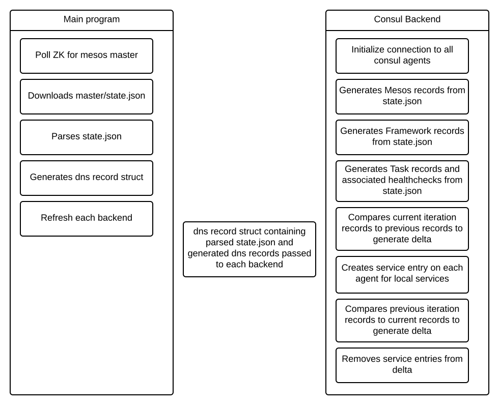
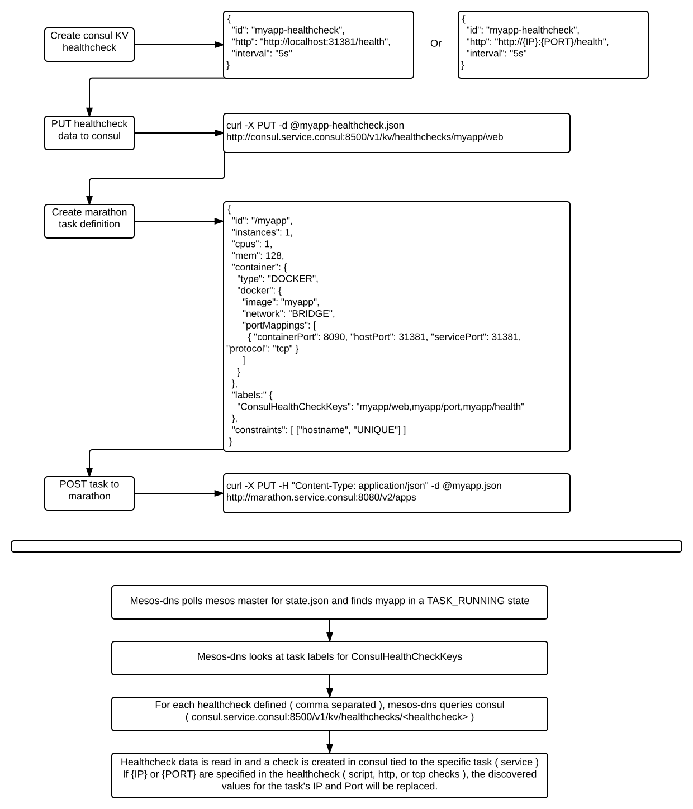

# Consul backend for Mesos-DNS

The consul backend supports creating DNS records in consul via mesos-dns. This means that all mesos slave records, framework records, and task records found in `state.json` will be parsed and created as service definitions on the appropriate consul agents.
This backend also supports using consul KV store to create healthcheck templates that will get assigned to the appropriate tasks. More information can be found below. 

# Backend workflow

## Diagram



# User workflow

## Diagram



# Healthcheck Design

To maintain a hands off approach to intelligent service discovery, we offer the ability to define a healthcheck in consul's KV store. This can be defined literally, `http://localhost:80/health`, or by using a variable, `http://{IP}:{PORT}/health`.

Supported variables for substition can be found below:

| Variable | Description |
|----------|-------------|
|  {IP}    | {IP} will be substituted with the discovered IP of the task/container. This can be useful if you are using calico to assign IP addresses |
|  {PORT}  | {PORT} will be substituted with the discovered Port of the task/container. |

To link the healthcheck to a task, use the `labels` field in the marathon task definition and define a key `ConsulHealthCheckKeys`. The value for this key will be a comma separated list of healthchecks that should be assigned to the task. 

## Healthchecks 

All healthchecks supported by consul, https://www.consul.io/docs/agent/checks.html,  are supported by this backend. The healthcheck definition should be json formatted.

### Location

The healthcheck will be created in consul under the `/v1/kv/healthchecks/<id>/<healthcheck id>` key where `<id>` is the app/task name and `<healthcheck id>` is whatever arbitrary name you give to the healthcheck. 

### Example

An example of defining and storing the healthcheck in consul is shown below:
```
# cat myapp-healthcheck.json
{
  "id": "myapp/healthcheck",
  "name": "myapp/healthcheck",
  "http": "http://localhost:5050/health",
  "interval": "5s"
}
# curl -X PUT -d @myapp-healthcheck.json http://consul.service.consul:8500/v1/kv/mesos-dns/healthchecks/myapp/web
```

The marathon task will specify a label `ConsulHealthCheckKeys`. This key will have a comma separated (no spaces) list of paths to pull healthchecks from. The paths are relative to `/v1/kv/healthchecks/`.
The following marathon task definition will pull in the healthcheck data from the three keys defined in consul: `myapp/web`, `myapp/port`, and `myapp/health`.

```
# cat myapp.json
{
  "id": "myapp",
  ...
  "labels:" {
    "ConsulHealthCheckKeys": "myapp/web,myapp/port,myapp/health"
  }
}
```

